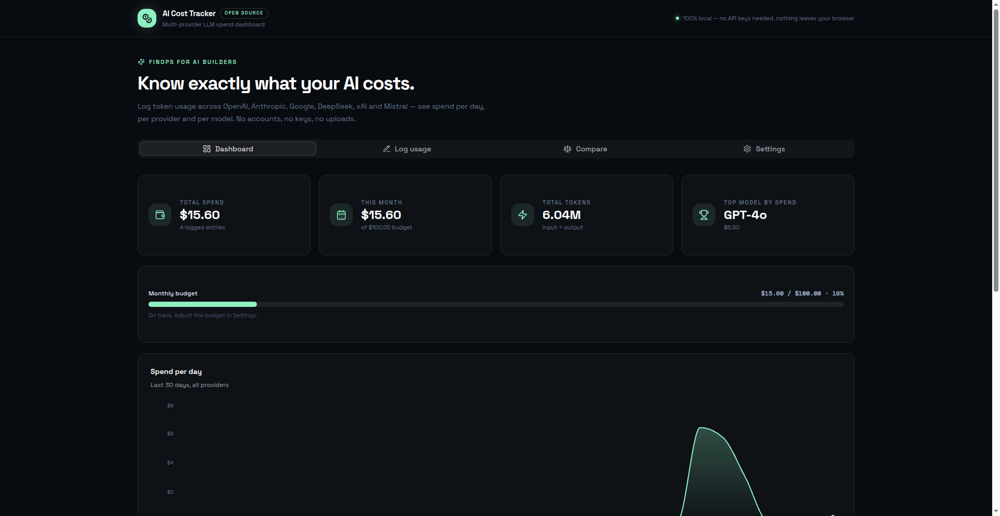
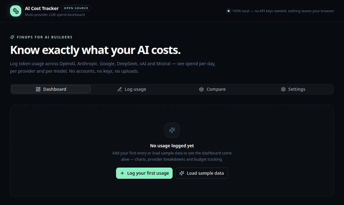

# AI Cost Tracker

[](https://devilking7x.github.io/ai-cost-tracker/) [](LICENSE)

> Know exactly what your AI costs. A local-first, multi-provider LLM spend dashboard — log token usage across OpenAI, Anthropic, Google, DeepSeek, xAI and Mistral, compare model prices, and stay on budget. No API keys, no accounts, nothing leaves your browser.

**Live demo:** https://devilking7x.github.io/ai-cost-tracker/

## 📸 Screenshots





## ✨ Features

- **Dashboard** — total spend, this month's spend, total tokens, top model by spend; spend-per-day area chart (30 days); spend-by-provider donut; spend-by-model bar chart
- **Monthly budget** — progress bar with amber warning past 90% and red alert when over budget
- **Log usage** — quick form (date, provider, model, input/output tokens, note) with instant cost calculation
- **CSV import/export** — bulk-load usage logs, download your entries any time
- **Compare** — enter one token workload, see what all 12 models would charge; cheapest highlighted with savings math
- **Price editor** — every model's input/output price is editable (prices change constantly); reset to defaults any time
- **Backup** — export/import full JSON backup, clear-all with confirmation
- **100% local** — localStorage only; no backend, no tracking, no API keys required


### ❤️ Bada Dil, Chhoti Madad
Ye tool free hai aur hamesha free rahega. Agar isne tumhara time ya paisa bachaya ho, to ek Star ⭐ de do aur chahe to sponsor kar do.
[⭐ Star this repo](https://github.com/devilking7x/ai-cost-tracker) [☕ Sponsor](https://github.com/sponsors/devilking7x)

## 📥 CSV format

```csv
date,provider,model,input_tokens,output_tokens,note
2026-09-20,openai,gpt-4o,1200000,340000,homepage rewrite
2026-09-21,anthropic,claude-sonnet-4,860000,210000,code review
```

- Providers match by id or name (case-insensitive): `openai`, `anthropic`, `google`, `deepseek`, `xai`, `mistral`
- Models match by id or label: `gpt-4o`, `claude-sonnet-4`, `gemini-2.5-flash`, …
- Header row is optional. Quoted fields with commas are supported.
- Bad rows are skipped with a per-row error message; good rows still import.

## 💲 About prices

Model prices change often. The built-in prices are plausible defaults only — **verify against each provider's pricing page** and update them in **Settings → Model prices**. Your overrides are stored locally in your browser.

## 🚀 Quick start

```bash
pnpm install
pnpm dev
```

Build for production:

```bash
pnpm build
```

The app is a static site — deploy the `dist/` output anywhere (GitHub Pages, Netlify, Vercel).

## 🔒 Privacy

Everything runs in your browser tab. Usage logs, price overrides and budget live in `localStorage` under `ai-cost-tracker:v1`. No network requests are made except loading the page itself.

## 🤝 Contributing

See [CONTRIBUTING.md](CONTRIBUTING.md). Bug reports and price updates are welcome.

## 📄 License

MIT — see [LICENSE](LICENSE).
